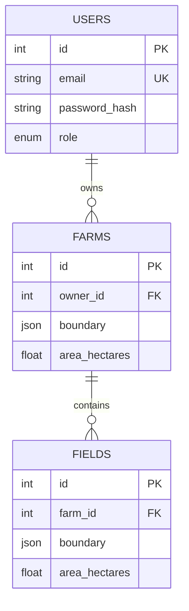

# Core ER diagram

```mermaid
erDiagram
  USERS ||--o{ FARMS : owns
  FARMS ||--o{ FIELDS : contains
  USERS { int id PK string email UK string password_hash enum role }
  FARMS { int id PK int owner_id FK json boundary float area_hectares }
  FIELDS { int id PK int farm_id FK json boundary float area_hectares }
```
